# Brain Tumor MRI Classification Pipeline

Automated four-class, 2D brain MRI classification pipeline built for a single-GPU workstation. The system acquires and verifies a Kaggle dataset, creates a reproducible preprocessing cache, trains and tunes PyTorch models, evaluates candidates on an untouched Testing partition, applies a metric plus Grad-CAM promotion gate, and serves the approved model through FastAPI.

The project is backend-only. The previously created Next.js dashboard was intentionally removed. Operations are performed through the API, MLflow, command-line scripts, and generated artifacts.

## What the System Does

The pipeline classifies MRI images into four classes:

- `glioma`
- `meningioma`
- `notumor`
- `pituitary`

The production path is:

```text
Kaggle dataset or ZIP archive
    -> content-hashed raw dataset
    -> structure, decode, duplicate, and leakage verification
    -> deterministic brain-region crop, resize, normalization
    -> config-hashed tensor cache
    -> stratified train/validation split
    -> baseline training or Optuna tuning
    -> MLflow Staging
    -> untouched Testing evaluation
    -> Grad-CAM sanity check
    -> Production registry model
    -> FastAPI inference with lineage and Grad-CAM overlay
```

### System Flowchart

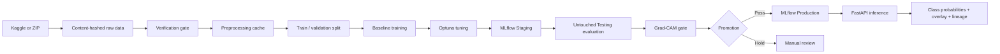

### Runtime Architecture

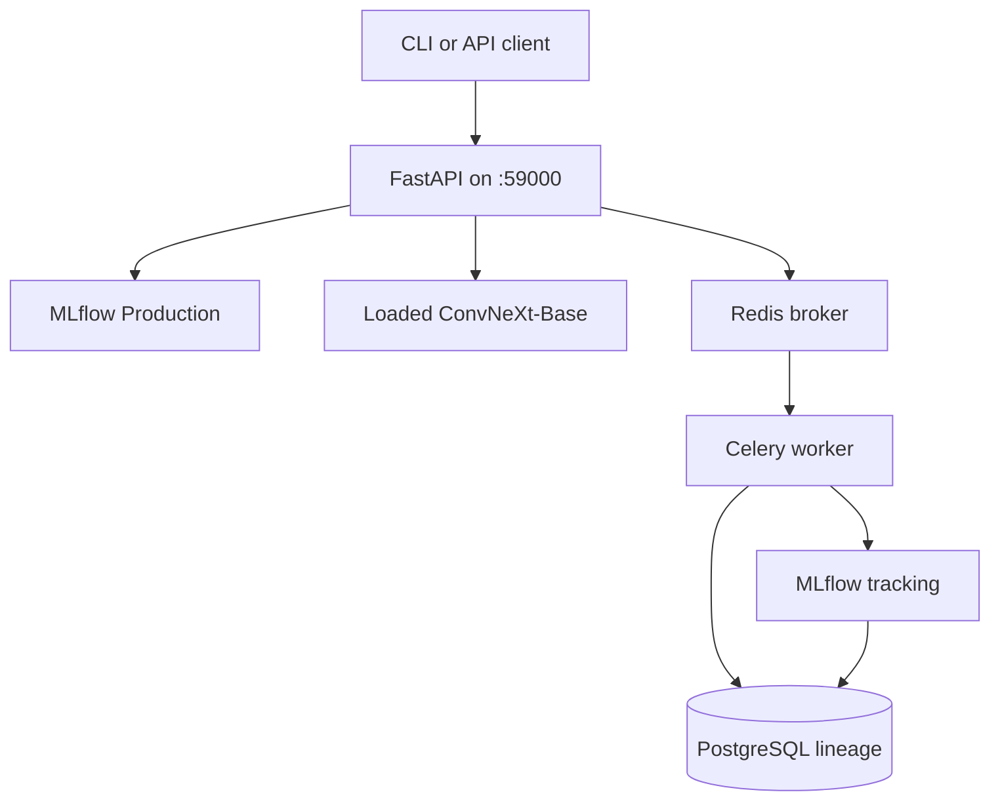

## Scope

Included:

- 2D image classification
- Four tumor/non-tumor classes
- Single RTX-class GPU training
- PyTorch and torchvision architectures
- Celery/Redis asynchronous task plumbing
- PostgreSQL lineage metadata
- MLflow tracking and model registry
- Optuna hyperparameter tuning
- FastAPI inference API
- CLI dataset, preprocessing, training, evaluation, and inference tools

Excluded:

- Segmentation
- Survival prediction
- 3D volumetric processing
- Multi-GPU distributed training
- Online continuous retraining
- Frontend/dashboard

## Environment

The project uses the existing Conda environment named `brainseg`.

```powershell
conda activate brainseg
```

Verify the environment:

```powershell
python --version
python -c "import torch; print(torch.__version__); print('CUDA:', torch.cuda.is_available())"
```

Use `python -m pytest`, not the standalone `pytest` command. The machine previously had a stale `pytest.exe` launcher pointing to another Conda environment.

Install the project dependencies if needed:

```powershell
python -m pip install -e ".[dev]"
```

## Runtime Services

Compose uses the isolated project name `btc-classification` so it does not conflict with the existing `brainseg` Docker deployment.

| Service | Host address | Purpose |
|---|---:|---|
| FastAPI | `http://localhost:59000` | Health, model metadata, and inference |
| FastAPI docs | `http://localhost:59000/docs` | Interactive OpenAPI documentation |
| PostgreSQL | `localhost:55432` | Pipeline lineage and MLflow metadata |
| Redis | `localhost:56379` | Celery broker and result backend |
| MLflow | `http://localhost:55000` | Experiments and model registry |
| Celery worker | internal | Long-running pipeline tasks |

Start the services:

```powershell
docker compose up -d postgres redis mlflow api celery-worker
```

Check container status:

```powershell
docker compose ps
```

Apply database migrations:

```powershell
python -m alembic upgrade head
```

Check API health:

```powershell
Invoke-WebRequest -UseBasicParsing http://localhost:59000/health |
  Select-Object -ExpandProperty Content
```

Expected healthy response includes:

```json
{
  "status": "ok",
  "checks": {
    "postgres": {"status": "ok"},
    "redis": {"status": "ok"},
    "mlflow": {"status": "ok"}
  },
  "model": {
    "loaded": true,
    "model_name": "brainseg-convnext-base",
    "model_version": "1",
    "architecture": "convnext_base"
  }
}
```

Stop services without deleting persistent data:

```powershell
docker compose down
```

Do not use `docker compose down -v` unless you intentionally want to delete PostgreSQL, Redis, and MLflow volumes.

## Configuration and Secrets

Configuration is read from `.env` locally and from Compose environment variables inside containers. `.env` is Git-ignored.

Required Kaggle variables:

```env
KAGGLE_USERNAME=your_username
KAGGLE_KEY=your_api_key
```

Never commit real Kaggle credentials. If a credential is exposed, revoke it in Kaggle and create a replacement.

The important local settings are:

```env
POSTGRES_PORT=55432
REDIS_PORT=56379
MLFLOW_PORT=55000
API_PORT=59000
```

The API host port `59000` was selected because lower nearby ports were reserved by Windows. If it conflicts on another machine, change `API_PORT` in `.env` and update the URL used by clients.

## Dataset

The verified dataset source is:

```text
masoudnickparvar/brain-tumor-mri-dataset
```

Expected layout:

```text
Training/
  glioma/
  meningioma/
  notumor/
  pituitary/
Testing/
  glioma/
  meningioma/
  notumor/
  pituitary/
```

Expected counts:

| Split | Per class | Total |
|---|---:|---:|
| Training | 1,400 | 5,600 |
| Testing | 400 | 1,600 |
| Total | 1,800 | 7,200 |

The verified dataset content hash is:

```text
974e32f0fa628a307ba1bc2ec7f48d137b8190da0582678d7c5c75c8120bf383
```

The local raw dataset is expected at:

```text
data\raw\974e32f0fa628a307ba1bc2ec7f48d137b8190da0582678d7c5c75c8120bf383
```

### Dataset Verification Policy

The acquisition script performs:

- Directory and class checks
- Per-class count checks
- PIL decode checks
- Corrupt-file reporting
- Exact cross-split MD5 duplicate detection
- Perceptual near-duplicate detection
- Image dimension and format summaries
- Per-class file-size summaries

This dataset has an accepted project exception: near-duplicate train/test findings are retained as soft findings. They remain in the report but do not block preprocessing when `--allow-near-duplicates` is provided. Exact duplicates, corrupt files, structural errors, and count errors remain blocking.

## Step 1: Download and Verify

Run the real Kaggle acquisition:

```powershell
python scripts/download_dataset.py `
  --dataset masoudnickparvar/brain-tumor-mri-dataset `
  --allow-near-duplicates
```

The script exits with:

- `0`: dataset is verified and ready for preprocessing
- `1`: verification failed
- `2`: acquisition or extraction failed

Reports are written to:

```text
artifacts\verification\<dataset_version_hash>\verification_report.json
artifacts\verification\<dataset_version_hash>\verification_report.md
```

For offline testing with a local archive:

```powershell
python scripts/download_dataset.py `
  --archive .\dataset.zip `
  --train-count 2 `
  --test-count 2
```

## Step 2: Visualize the Dataset

Generate class charts, image dimensions, file-size distributions, format charts, sample grids, and a data-flow graphic:

```powershell
python scripts/visualize_dataset.py `
  --dataset-root data\raw\974e32f0fa628a307ba1bc2ec7f48d137b8190da0582678d7c5c75c8120bf383 `
  --output-root artifacts\visualization
```

Open the report:

```text
artifacts\visualization\README.md
```

Generated files include:

- `class_distribution.png`
- `image_dimensions.png`
- `file_size_distribution.png`
- `format_distribution.png`
- `samples_training.png`
- `samples_testing.png`
- `data_flow.png`
- `summary.json`

Dataset charts and sample images:

<table>
  <tr>
    <td>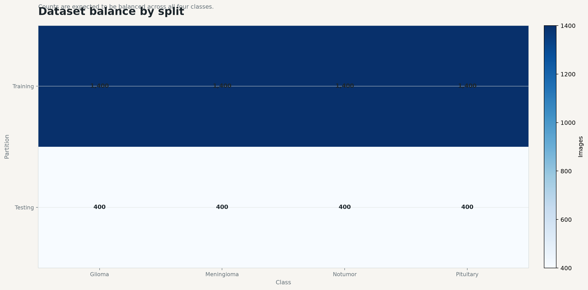</td>
    <td>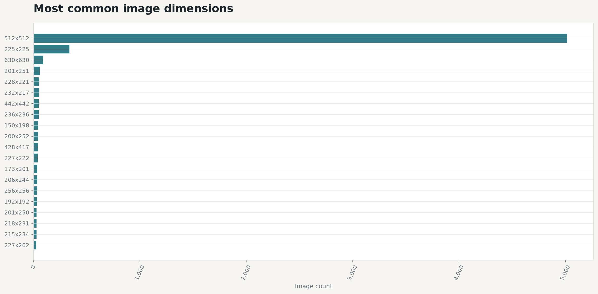</td>
  </tr>
  <tr>
    <td>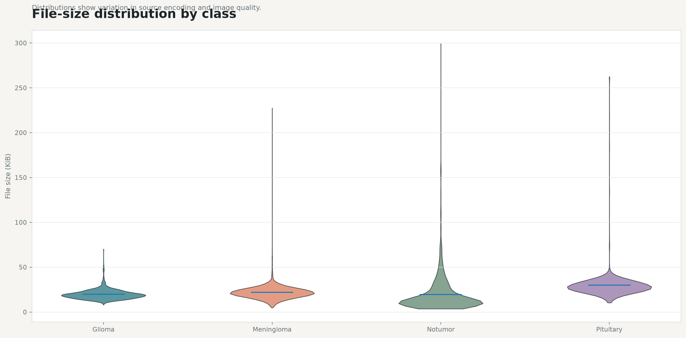</td>
    <td>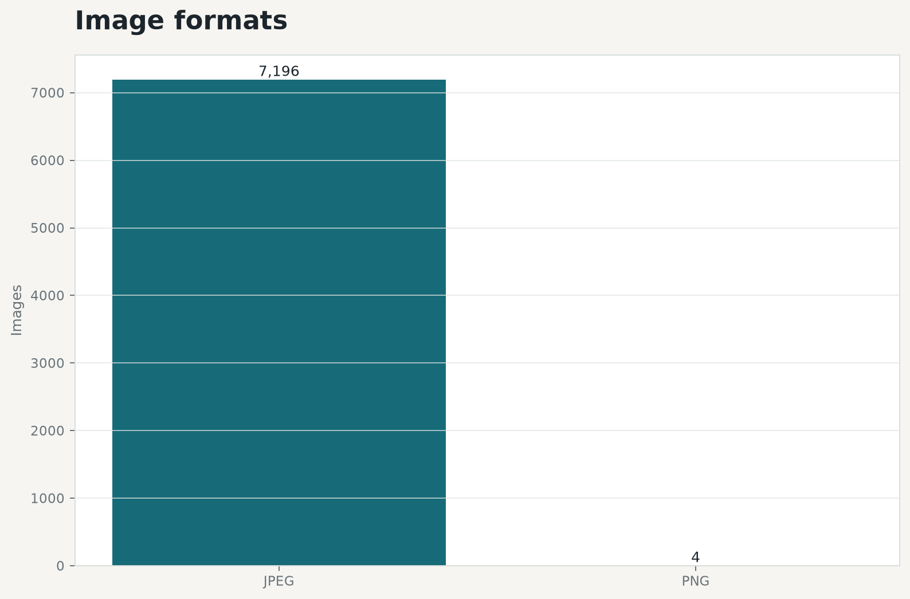</td>
  </tr>
  <tr>
    <td>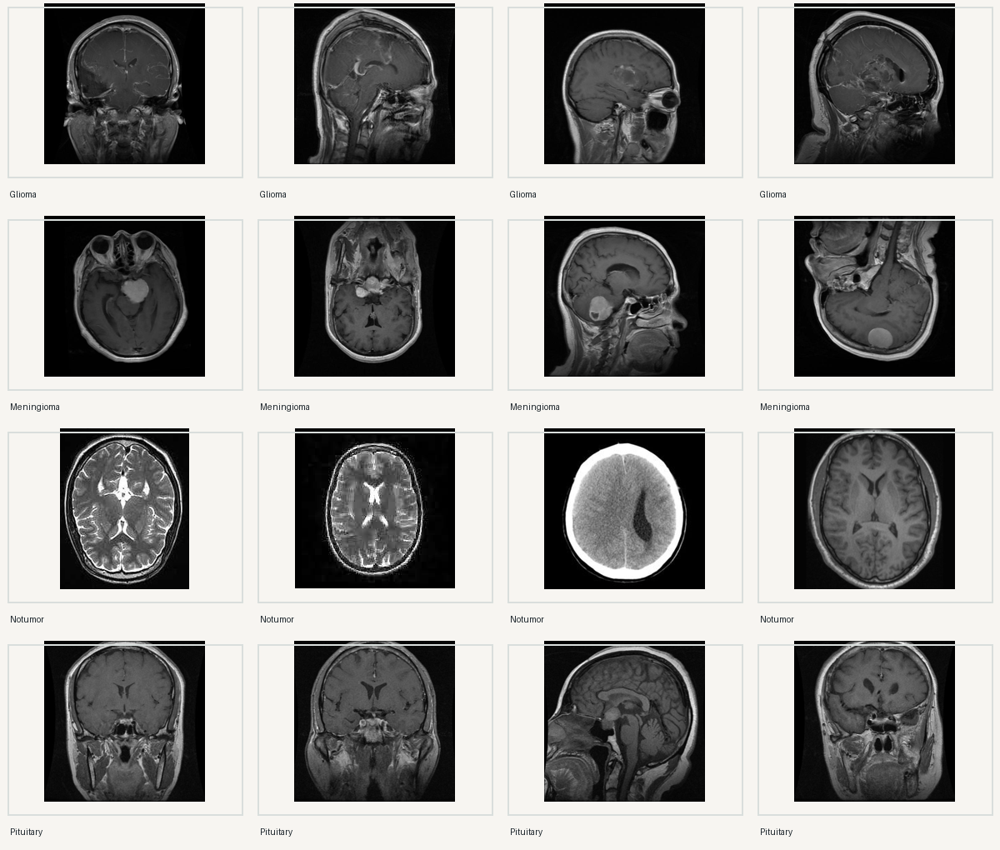</td>
    <td>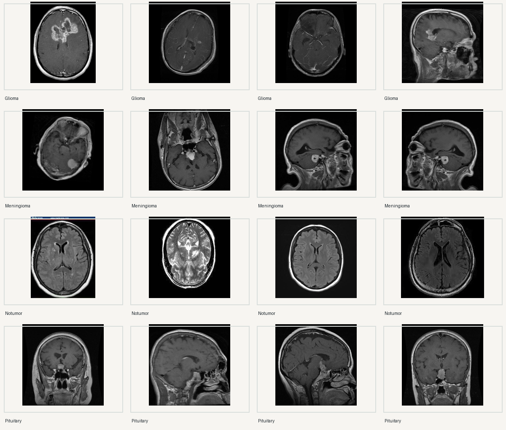</td>
  </tr>
</table>

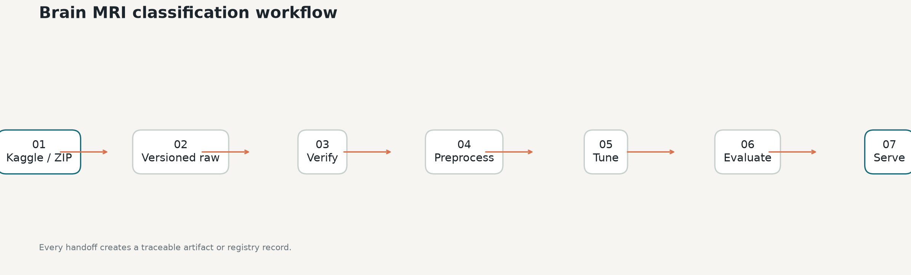

## Step 3: Preprocess the Dataset

The preprocessing pipeline:

- Converts images to RGB
- Applies Otsu thresholding
- Crops the largest connected foreground region
- Falls back safely when no usable region is found
- Resizes to `224x224`
- Applies ImageNet normalization
- Writes one PyTorch tensor per image
- Generates a deterministic 85/15 stratified split from Training
- Keeps Testing untouched

Run preprocessing:

```powershell
python scripts/preprocess_dataset.py `
  --dataset-root data\raw\974e32f0fa628a307ba1bc2ec7f48d137b8190da0582678d7c5c75c8120bf383 `
  --output-root data\processed `
  --artifact-root artifacts\preprocessing
```

The verified preprocessing config hash is:

```text
7d91c97fccc3d9b58cbb353d373584651e6a2f21c5d67262f0064c78316611d8
```

The processed manifest is:

```text
data\processed\7d91c97fccc3d9b58cbb353d373584651e6a2f21c5d67262f0064c78316611d8\manifest.json
```

Expected partition counts:

```text
Train:       4,760
Validation:    840
Testing:     1,600
Total:       7,200
```

Run the same command again to confirm:

```text
cache_hit: true
```

Changing a preprocessing parameter produces a new cache directory instead of overwriting the old one.

Preprocessing produces a preview grid and split evidence under:

```text
artifacts/preprocessing/
```

If the preview image is present, it can be viewed directly:

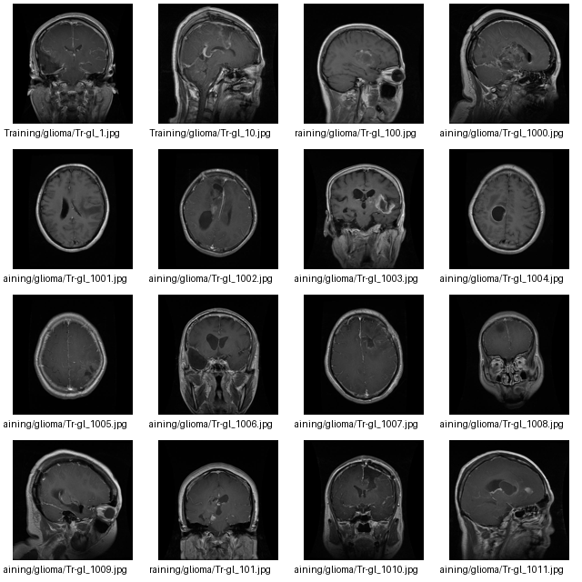

## Step 4: Train a Baseline

Supported architectures:

- `convnext_tiny`
- `convnext_base`
- `resnet50`
- `efficientnet_b0`

The trainer uses:

- Torchvision pretrained weights by default
- Head-only warm-up
- Partial backbone unfreezing
- AMP on CUDA
- Validation macro-F1 checkpoint selection
- Early stopping support
- MLflow parameter/metric/artifact logging

Example ConvNeXt-Base baseline:

```powershell
python scripts/train_baselines.py `
  --manifest data\processed\7d91c97fccc3d9b58cbb353d373584651e6a2f21c5d67262f0064c78316611d8\manifest.json `
  --architecture convnext_base `
  --checkpoint-root artifacts\checkpoints\convnext-base `
  --batch-size 32 `
  --head-warmup-epochs 5 `
  --fine-tune-epochs 10 `
  --device cuda `
  --mlflow-tracking-uri http://localhost:55000
```

For an offline smoke run without pretrained weight download:

```powershell
python scripts/train_baselines.py `
  --manifest data\processed\7d91c97fccc3d9b58cbb353d373584651e6a2f21c5d67262f0064c78316611d8\manifest.json `
  --architecture convnext_base `
  --checkpoint-root artifacts\checkpoints\convnext-base-smoke `
  --head-warmup-epochs 1 `
  --fine-tune-epochs 1 `
  --device cuda `
  --no-pretrained `
  --mlflow-tracking-uri file:./mlruns
```

Best checkpoints are saved as:

```text
artifacts\checkpoints\<run>\<architecture>_best.pt
```

## Step 5: Tune with Optuna

The tuner creates one resumable study per architecture. It optimizes validation macro-F1 and searches:

- Head learning rate: `1e-5` to `1e-3`
- Fine-tune learning rate: `1e-6` to `1e-4`, constrained below head LR
- Weight decay: `1e-4` to `1e-1`
- Unfreeze depth: `1`, `2`, or `3`
- Batch size: `16`, `32`, or `64`
- Warm-up epochs: `2` to `5`
- Fine-tune epochs: `5` to `15`
- Augmentation strength: light, medium, or heavy

Run a 40-trial ConvNeXt-Base study:

```powershell
python scripts/tune_models.py `
  --manifest data\processed\7d91c97fccc3d9b58cbb353d373584651e6a2f21c5d67262f0064c78316611d8\manifest.json `
  --architecture convnext_base `
  --trials 40 `
  --device cuda `
  --mlflow-tracking-uri http://localhost:55000
```

The study uses TPE sampling, MedianPruner, nested MLflow runs, resumable PostgreSQL storage in the `optuna` schema, and CUDA OOM handling.

The completed study used in this release:

```text
Study: brainseg-convnext_base
Best trial: 26
Validation macro-F1: 0.9940503
```

Summary and best checkpoint:

```text
artifacts\tuning\convnext_base_study_summary.json
artifacts\tuning\trial_26.pt
```

Training evidence is stored as checkpoint and JSON summary files. For the
release model, the tuned Trial 26 checkpoint is the source used for evaluation
and registry promotion:

```text
artifacts/tuning/trial_26.pt
artifacts/tuning/convnext_base_study_summary.json
```

### Tuning Lifecycle

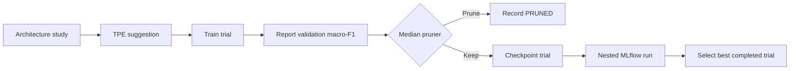

## Step 6: Register and Stage the Best Trial

Register Trial 26 in MLflow:

```powershell
python scripts/promote_trial.py `
  --checkpoint artifacts\tuning\trial_26.pt `
  --summary artifacts\tuning\convnext_base_study_summary.json `
  --model-name brainseg-convnext-base `
  --tracking-uri http://localhost:55000
```

The model must be evaluated before Production promotion.

## Step 7: Evaluate the Untouched Testing Split

This step uses only the `testing` partition. It does not affect tuning or checkpoint selection.

```powershell
python scripts/evaluate_model.py `
  --manifest data\processed\7d91c97fccc3d9b58cbb353d373584651e6a2f21c5d67262f0064c78316611d8\manifest.json `
  --checkpoint artifacts\tuning\trial_26.pt `
  --output-root artifacts\evaluation\convnext-base-tuned-complete `
  --device cuda
```

Promotion thresholds:

- Test macro-F1 >= `0.95`
- Every per-class F1 >= `0.90`
- Grad-CAM sanity check passes

Release evaluation result:

```text
Accuracy: 0.964375
Macro-F1: 0.963874
Minimum per-class F1: 0.928759
Grad-CAM: PASS
Failure cases: 57
```

Evaluation artifacts:

```text
artifacts\evaluation\convnext-base-tuned-complete\evaluation_summary.json
artifacts\evaluation\convnext-base-tuned-complete\metrics.json
artifacts\evaluation\convnext-base-tuned-complete\confusion_matrix.png
artifacts\evaluation\convnext-base-tuned-complete\failure_cases.json
artifacts\evaluation\convnext-base-tuned-complete\failure_gallery\index.html
artifacts\evaluation\convnext-base-tuned-complete\explainability_review.json
```

Evaluation chart:

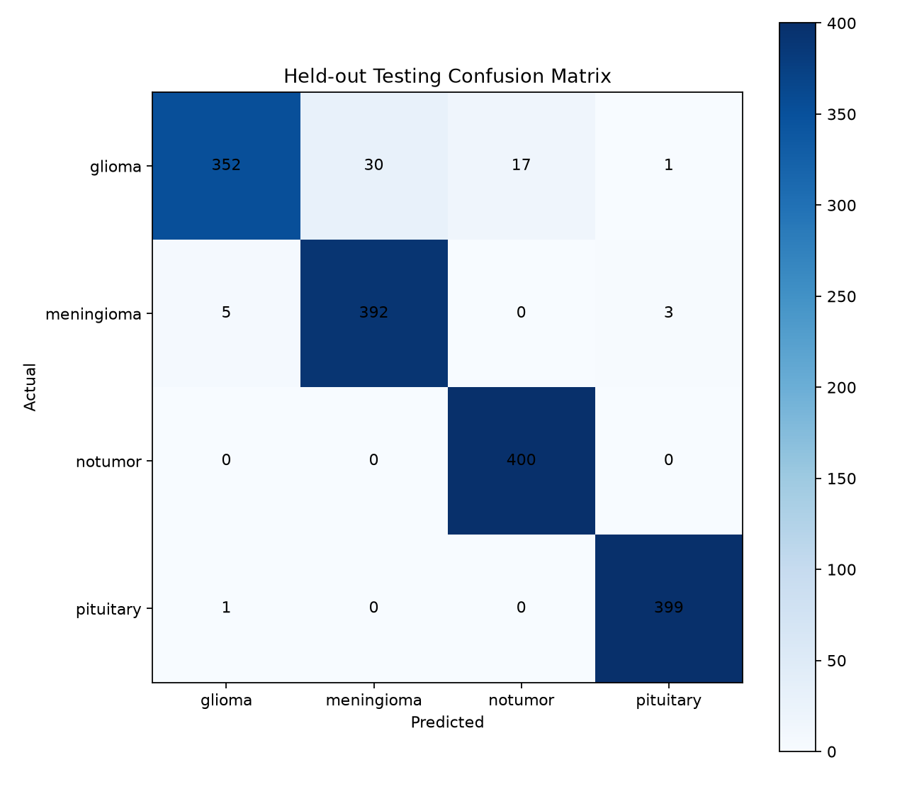

Grad-CAM control examples:

<table>
  <tr>
    <td></td>
    <td></td>
    <td></td>
    <td></td>
  </tr>
</table>

Complete failure gallery:

```text
artifacts/evaluation/convnext-base-tuned-complete/failure_gallery/index.html
```

Open it with:

```powershell
Start-Process artifacts\evaluation\convnext-base-tuned-complete\failure_gallery\index.html
```

## Step 8: Promote to Production

MLflow stages are stored in the shared PostgreSQL-backed registry.

Confirm the model stage:

```powershell
python -c "import mlflow; mlflow.set_tracking_uri('http://localhost:55000'); c=mlflow.MlflowClient(); print([(v.version, v.current_stage) for v in c.get_latest_versions('brainseg-convnext-base')])"
```

The release model is:

```text
brainseg-convnext-base version 1 Production
```

## Step 9: Use the FastAPI Inference API

Check live model metadata:

```powershell
curl.exe http://localhost:59000/model-info
```

Send one image:

```powershell
curl.exe -sS -X POST `
  -F "file=@data/raw/974e32f0fa628a307ba1bc2ec7f48d137b8190da0582678d7c5c75c8120bf383/Testing/glioma/Te-gl_1.jpg" `
  http://localhost:59000/predict
```

The response contains:

- `predicted_class`
- `confidence`
- `probabilities`
- `gradcam_overlay_base64`
- model version
- architecture
- training run ID
- dataset version hash
- preprocessing config hash

The API automatically polls MLflow for a newer Production version and atomically reloads it. A failed reload keeps the last known-good model.

### Inference Response Flow

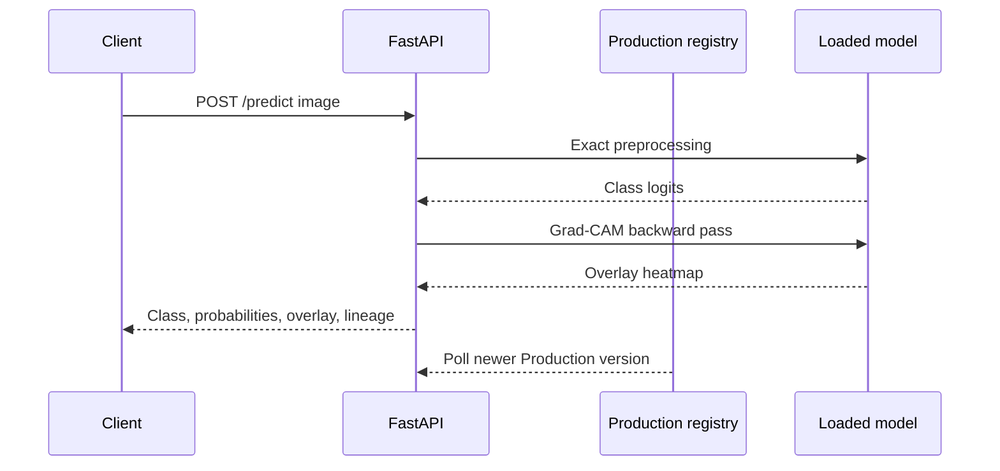

## Step 10: Local CLI Inference

For saving highlighted images to disk instead of receiving a base64 overlay:

```powershell
python scripts/infer_images.py `
  --folder data\raw\974e32f0fa628a307ba1bc2ec7f48d137b8190da0582678d7c5c75c8120bf383\Testing `
  --checkpoint artifacts\tuning\trial_26.pt `
  --output-root artifacts\inference\convnext-base-testing `
  --device cuda
```

Example highlighted inference image:

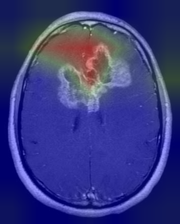

Prediction summaries:

```text
artifacts/inference/convnext-base-production/predictions.json
artifacts/inference/convnext-base-production/predictions.csv
```

## Tests and Audits

Run all tests:

```powershell
python -m pytest
```

Run the final non-destructive audit:

```powershell
python scripts/release_audit.py
```

The audit verifies:

- Live API and MLflow health
- Processed manifest and dataset hash
- Total record count
- Train/validation/testing isolation
- Evaluation and explainability artifacts
- Production checkpoint presence
- `.env` ignored by Git

## CI/CD

GitHub Actions workflows are provided under `.github/workflows/`:

- `ci.yml`: Ruff lint, format check, Mypy, Python compilation, pytest coverage, migration SQL generation, Compose validation, Gitleaks, pip-audit, and Docker image builds.
- `cd.yml`: semantic-tag GHCR image publishing and a protected manual deployment gate.

Detailed workflow behavior and required GitHub environment secrets are documented in `docs/CI_CD.md`.

Run the main CI checks locally:

```powershell
python -m pip install -e ".[dev]"
python -m ruff check app scripts worker tests
python -m ruff format --check app scripts worker tests
python -m mypy app worker scripts
python -m compileall -q app migrations scripts worker tests
python -m pytest --cov=app --cov=worker --cov-report=term-missing
docker compose config --quiet
python -m alembic upgrade head --sql
```

## Repository Layout

```text
app/
  datasets/       Acquisition, hashing, verification
  db/             SQLAlchemy models and sessions
  evaluation/     Testing evaluation, Grad-CAM, promotion gates
  inference/      Production model loader and prediction service
  preprocessing/  Crop, normalization, cache, split logic
  training/       Models, datasets, metrics, trainer
  tuning/         Optuna studies and promotion helpers
docs/             Runbook, API, architecture, evidence index
infra/            Dockerfiles and PostgreSQL/MLflow setup
migrations/       Alembic migrations
scripts/          Operational CLIs
tests/            Unit, integration, and contract tests
worker/           Celery application and tasks
data/             Raw and processed datasets; generated and Git-ignored
artifacts/        Checkpoints, reports, galleries, and release evidence
```

## Important Limitations

- The dataset intentionally retains accepted near-duplicate train/test findings, so performance may be optimistic.
- `.env` contains local secrets and must never be committed or shared.
- MLflow stage APIs are deprecated in newer MLflow versions; this project currently uses them because the registry contract requires `Staging` and `Production`.
- The release audit does not redownload Kaggle data or rerun all 40 tuning trials on every invocation.
- Authentication, TLS, external deployment access control, inference retention, and patient-data policy remain open deployment decisions.

## Project Documents

- `PRD.md`: Product requirements
- `TASKS.md`: Implementation tasks and proof-of-work
- `DECISION.md`: Architecture decisions and open decisions
- `docs/RUNBOOK.md`: Operations runbook
- `docs/API.md`: API contract
- `docs/ARCHITECTURE.md`: System architecture and current lineage
- `docs/PROOF.md`: Phase evidence index
